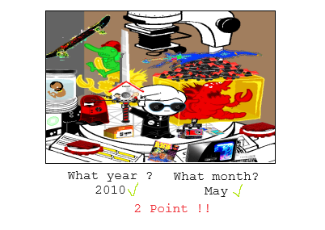

# startup
Startup application for BYU CS 260
Elevator Pitch:
Antidepressants
Because I am currently going through a mental pain and need some more time to finish this so I don't 

My bloody computer crashed before I was able to commit the actual document, and while making it I realized that the idea is kind of crap
so
I am going to invoke accomodations for the time being and make an actually coherent specification later

Ok yeah 
The idea was "Input a webcomic website, and then you need to guess in what year the comic selected came out"
But due to the multiplicity of websites and webservers yeah I realize that this would likely be a bit too headache enducing

Other ideas included a CandyBox Like game where you...
ok actually I like that idea a lot more now that I am writing this document
An unfolding type game wherein you upload various files to the server in order to go through a sort of story
A bit like Drawn to Life combined with random Jpegs you find on your pc, and also Candybox.
though I may need to look into this to see if it is actually worth working on, and if it will fall to the pain of feature creep.
...
Image Wars
Upload photo to the site
It is given stats from an arbitrary algorithm (file size, file type, colors used, etc.)
and you can pit them against other files.
In a way it takes the idea of "the algorithm" that most social media sites work on and takes the piss out of it. 
I actually like this idea a lot, I may go for it.
Again, this will be more coherent by Friday

This is a basic idea of the Webcomic website, and the only file that remained after the computer crash.

I'm gonna hash out the Image Wars idea more, could be fun
Only issue is moderation, and yeah this is something that I will work on

